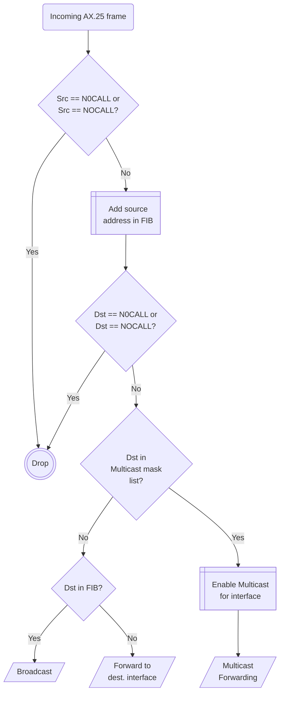
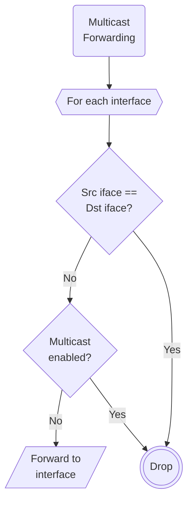

# vpsed
Virtual AX.25 Packet Switching Equipment

## Packet Switching strategy

```mermaid
flowchart TD
    Start@{ shape: rounded, label: "Incoming AX.25 frame" }
    Start --> SrcDroppable{"Src == N0CALL or<br> Src == NOCALL?"}
    SrcDroppable -->|No| FIBAdd@{ shape: win-pane, label: "Add source<br>address in FIB" }
    SrcDroppable --> |Yes| Drop
    FIBAdd --> Droppable{"Dst == N0CALL or<br> Dst == NOCALL?"}
    Droppable --> |No| Mcast{"<br>Dst in<br>Multicast mask<br>list?"}
    Droppable --> |Yes| Drop
    Drop@{ shape: dbl-circ, label: "Drop" }
    Mcast --> |No| FIBCheck{"Dst in FIB?"}
    Mcast --> |Yes| EnableMCast@{ shape: win-pane, label: "Enable Multicast<br>for interface" }
    EnableMCast--> MCastFW@{ shape: lean-r, label: "Multicast<br>Forwarding" }
    FIBCheck --> |Yes| BCast@{ shape: lean-r, label: "Broadcast" }
    FIBCheck --> |No| Forward@{ shape: lean-r, label: "Forward to<br>dest. interface" }
```

## Multicast Forwarding

```mermaid
flowchart TD
    Start@{ shape: rounded, label: "Multicast<br>Forwarding" }
    Start --> ForeachIface@{ shape: hex, label: "For each interface" }
    ForeachIface --> SrcDroppable{"Src iface ==<br>Dst iface?"}
    SrcDroppable -->|No| MCastEN{"Multicast<br>enabled?"}
    SrcDroppable --> |Yes| Drop@{ shape: dbl-circ, label: "Drop" }
    MCastEN -->|No| Forward@{ shape: lean-r, label: "Forward to<br>interface" }
    MCastEN --> |Yes| Drop
```
